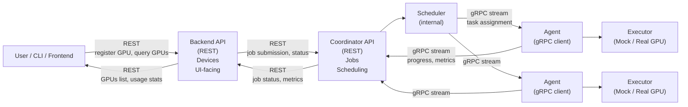

# Gpu Share

**Gpu Share** is a platform for renting gpu compute. It allows gpu owners to
offer their resources to others. Users can borrow gpu compute without the need
to buy a gpu themselves.

## Requirements

- `Docker`
- `Docker Compose`

## Usage

```bash
# Clone the repository.
git clone https://github.com/kamil7430/gpu-share.git
# Make sure that Docker daemon is up.
sudo systemctl start docker
```

Since Docker can handle only one composition of containers within one subnet,
you can encounter an error like this: 

```
failed to create network docker_network: Error response from daemon: invalid pool request: 
Pool overlaps with other one on this address space
```

In that case you need to _decompose_ the server/test you were using, before composing
the other.

```bash
docker compose down -v
```

### Server

```bash
cd docker
docker compose up --build
```

### Tests

```bash
cd docker/test
docker compose up --build --abort-on-container-exit
```

## Architecture



## Tech stack

### Backend

- `Go`
- `PostgreSQL`
- `GORM`
- `REST API`
- `GRPC`
- `OpenAPI`
- `JWT`

### Frontend

- `ASP.NET Core` (.NET 10.0)
- `Blazor Web App` - Interactive Server Components
- `Blazorise` - Component library
- `Bootstrap 5` - Responsive CSS framework
- `C#` - Primary language
- `Razor Components` - Component-based architecture

### Others

- `Docker`
- `GitHub Actions`
- `GitHub Issues`

## Project structure

```text
backend/
gpu/
  agent/
  coordinator/
  proto/                     # protobuf for gRPC in coordinator <-> agent
contract/
  backend/                   # openapi contracts for backend
  gpu/                       # openapi contracts for gpu
docker/                      # production docker config
  test/                      # tests docker config
docs/
  decisions/                 # ADRs
  project_documentation.pdf  # specification
  # user stories in Issues
frontend/                    # Blazor ASP.NET Core frontend
  Components/                # Razor components (Pages, Layouts, Shared)
  Models/                    # Data models
  Services/                  # Business logic and API services
  Properties/                # Configuration and launch settings
  wwwroot/                   # Static files (CSS, images, scripts)
  Program.cs                 # Application entry point
  GpuShare.Frontend.csproj   # Project configuration
```

## Recommended workflow

1. Describe the use case and add an Issue.
2. Describe important decisions in the ADR directory.
3. Create a new feature branch.
4. If changing the API, first change the openapi yaml specification and run
codegen using `cd backend && go generate ./...`
5. Add unit and integration tests.
6. Develop production code.
7. When the feature is ready, create a pull request.

## Authors

- Kamil Błażejczyk ([kamil7430](https://github.com/kamil7430))
- Paweł Bielecki ([FreePlacki](https://github.com/FreePlacki))
- Kacper Grobel ([MajorFallen](https://github.com/MajorFallen))
- Anna Babicka ([ababicka11011](https://github.com/ababicka11011))
- Marcin Sulecki ([sulmar](https://github.com/sulmar))
